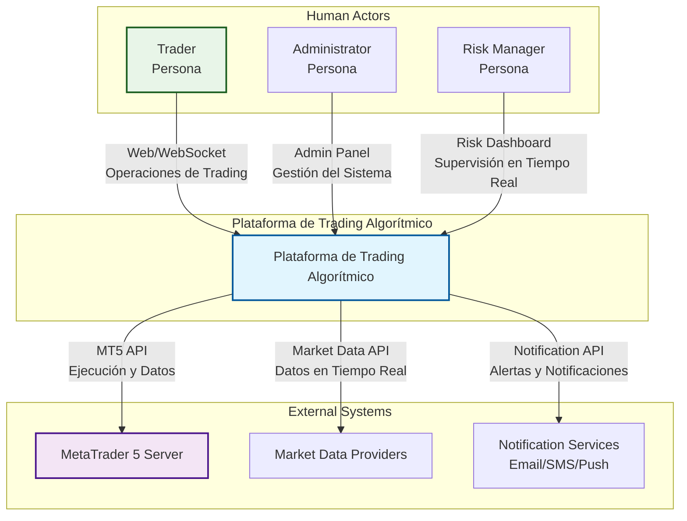
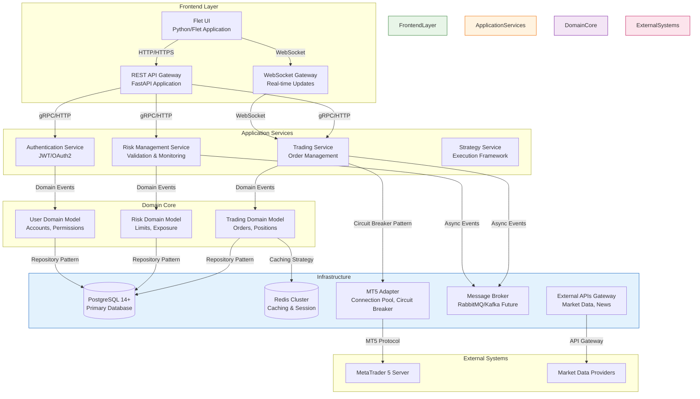
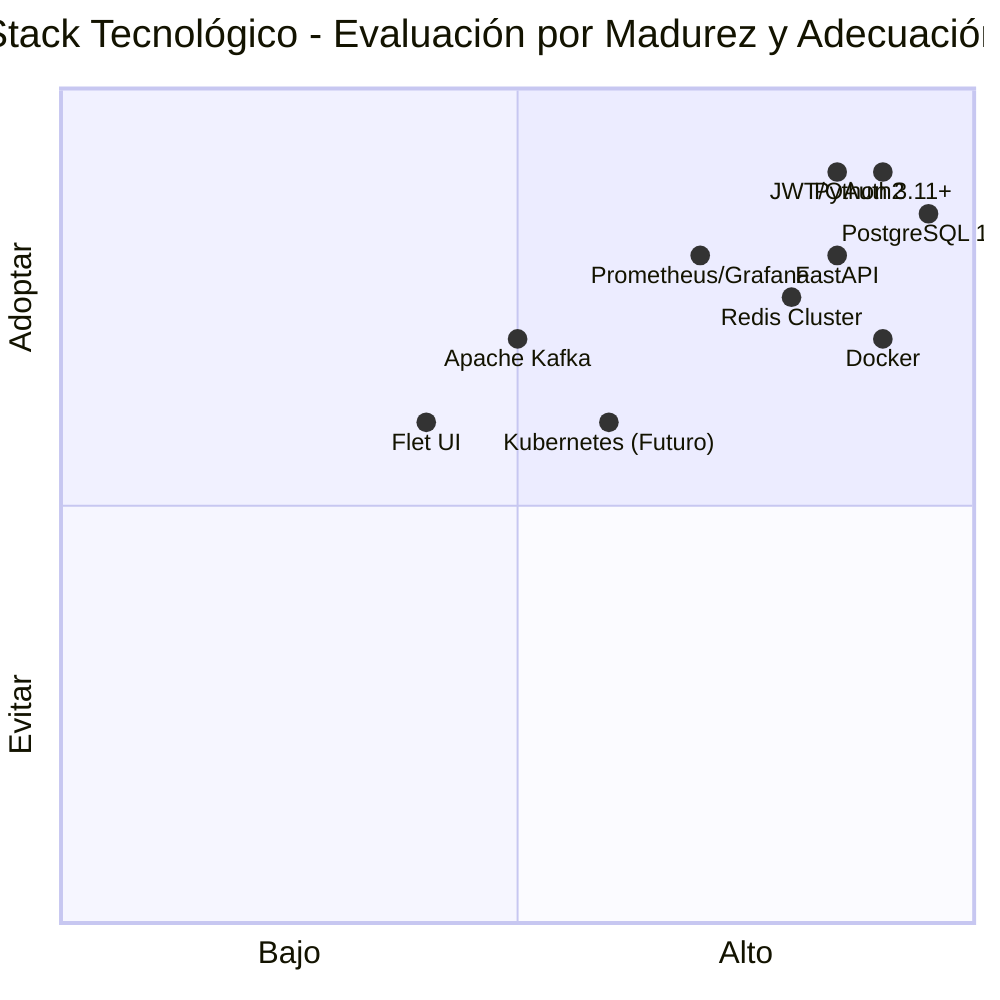
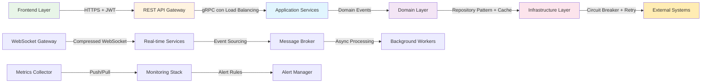
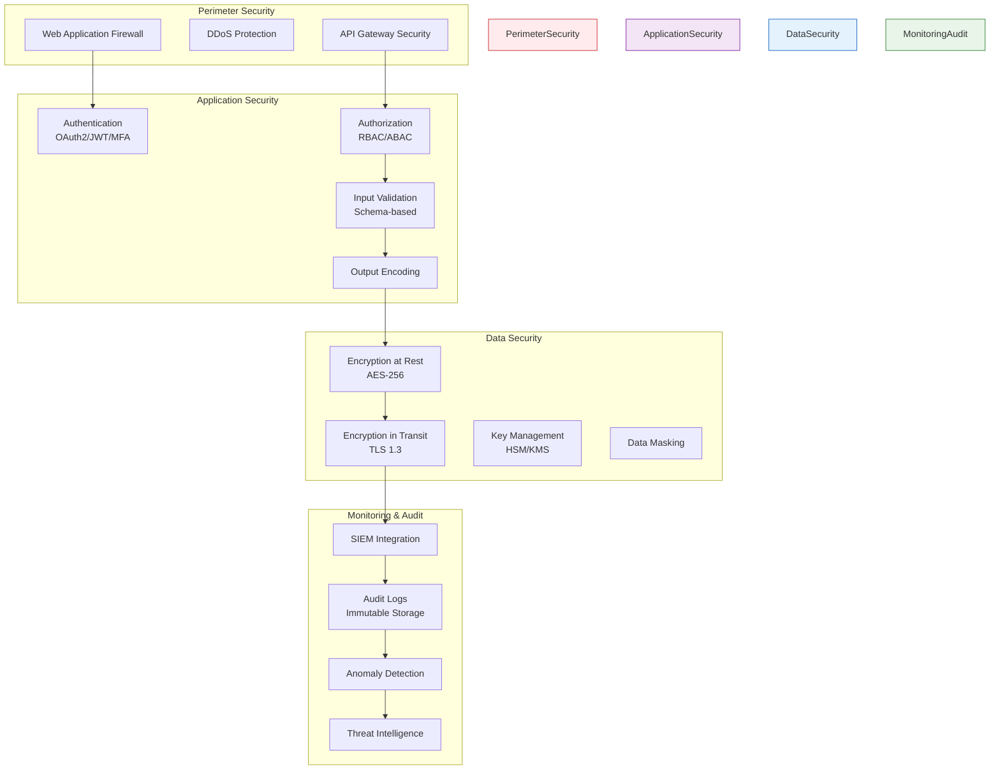
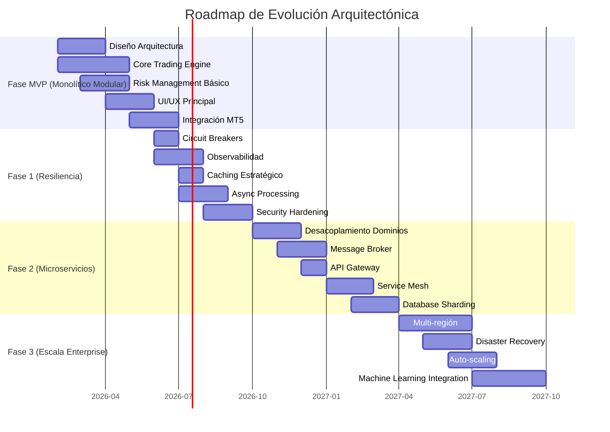

# C4 Architecture Model - Plataforma de Trading Algorítmico

**Versión:** 2.0  
**Fecha:** 3 de febrero de 2026  
**Documento Base:** Documento Rector v2.1  
**Rol Responsable:** Tech Lead  
**Estado:** APROBADO CON OPTIMIZACIONES

---

## 1. Introducción

Este documento presenta la arquitectura del sistema de trading algorítmico utilizando el modelo C4 (Contexto, Contenedores, Componentes y Código). El modelo C4 proporciona una forma escalonada de describir la arquitectura de software en diferentes niveles de detalle, ideal para sistemas complejos como plataformas de trading.

**Cambios en v2.0:**
- Migración de diagramas ASCII a Mermaid.js para mejor visualización
- Incorporación de optimizaciones de resiliencia y seguridad
- Adición de consideraciones de observabilidad y monitoreo
- Actualización del roadmap de escalabilidad

---

## 2. C4 Context Diagram

El diagrama de contexto muestra el sistema en su entorno, incluyendo los actores humanos y otros sistemas con los que interactúa.



**Descripción:**
- **Plataforma de Trading Algorítmico**: Sistema principal que permite trading manual y automático
- **Trader**: Usuario que opera el sistema para realizar trading manual o configurar estrategias
- **Administrador**: Personal encargado de la gestión del sistema y supervisión de riesgos
- **Risk Manager**: Especialista en monitoreo y control de exposición al riesgo
- **Servidor MT5**: Sistema externo de MetaTrader 5 que ejecuta las órdenes y provee datos de mercado
- **Market Data Providers**: Fuentes adicionales de datos financieros
- **Notification Services**: Servicios externos para envío de alertas

---

## 3. C4 Container Diagram

El diagrama de contenedores muestra los principales contenedores de software que forman parte del sistema.



---

## 4. C4 Component Diagram - Trading Engine

Diagrama detallado del componente principal de Trading Engine:

```mermaid
flowchart TD
    subgraph "Trading Engine Core"
        OrderManager[Order Manager<br/>- submit_order()<br/>- modify_order()<br/>- cancel_order()]
        
        PositionManager[Position Manager<br/>- get_position()<br/>- update_position()<br/>- close_position()]
        
        StrategyRunner[Strategy Runner<br/>- run_strategy()<br/>- stop_strategy()<br/>- pause_resume()]
    end

    subgraph "Integration Components"
        MT5Connector[MT5 Connector<br/>- connect()<br/>- disconnect()<br/>- reconnect()<br/>Circuit Breaker Pattern]
        
        RiskValidator[Risk Validator<br/>- validate_risk()<br/>- check_limits()<br/>- risk_alert()]
        
        OrderExecution[Order Execution Engine<br/>- execute_order()<br/>- handle_fill()<br/>- handle_rejection()]
    end

    subgraph "Support Components"
        OrderBook[Order Book<br/>- maintain()<br/>- sync_orders()<br/>- match_orders()]
        
        MarketDataFeed[Market Data Feed<br/>- subscribe()<br/>- unsubscribe()<br/>- process_feed()<br/>Cache Strategy]
        
        ExecutionReport[Execution Reporter<br/>- generate_report()<br/>- send_notifications()<br/>- store_history()]
    end

    subgraph "Monitoring & Observability"
        MetricsCollector[Metrics Collector<br/>- track_latency()<br/>- count_orders()<br/>- monitor_fill_rate()]
        
        HealthChecker[Health Checker<br/>- service_health()<br/>- dependency_status()<br/>- circuit_breaker_state()]
    end

    %% Core interactions
    OrderManager -->|Send for validation| RiskValidator
    OrderManager -->|Execute validated order| OrderExecution
    OrderManager -->|Update state| OrderBook
    
    PositionManager -->|Synchronize| MT5Connector
    StrategyRunner -->|Generate signals| OrderManager
    
    %% Integration flows
    MT5Connector -->|Stream prices| MarketDataFeed
    MT5Connector -->|Execute orders| OrderExecution
    
    RiskValidator -->|Check market conditions| MarketDataFeed
    
    %% Support flows
    MarketDataFeed -->|Update prices| OrderBook
    OrderExecution -->|Report fills| ExecutionReport
    
    %% Monitoring flows
    OrderExecution -->|Emit metrics| MetricsCollector
    MT5Connector -->|Health status| HealthChecker
    RiskValidator -->|Risk metrics| MetricsCollector
    
    %% External dependencies
    OrderExecution -.->|Async notification| MessageQueue
    ExecutionReport -.->|Store in DB| DB[(Database)]
    
    style TradingEngineCore fill:#e1f5fe,stroke:#0277bd
    style IntegrationComponents fill:#f3e5f5,stroke:#7b1fa2
    style SupportComponents fill:#e8f5e8,stroke:#2e7d32
    style MonitoringObservability fill:#fff3e0,stroke:#f57c00
```

**Interacciones Optimizadas:**
- **Circuit Breaker**: MT5Connector incluye patrón Circuit Breaker para manejo de fallos
- **Caching Estratégico**: MarketDataFeed implementa cache L1/L2 para datos frecuentes
- **Métricas en Tiempo Real**: Todos los componentes emiten métricas para observabilidad
- **Comunicación Asíncrona**: Notificaciones se envían a Message Queue para desacoplamiento

---

## 5. C4 Component Diagram - Risk Management

Diagrama detallado del componente de Gestión de Riesgo:

```mermaid
flowchart LR
    subgraph "Validation Layer"
        AccountRisk[Account Risk Validator<br/>- daily_loss_limit()<br/>- weekly_loss_limit()<br/>- equity_protection()]
        
        StrategyRisk[Strategy Risk Validator<br/>- max_exposure()<br/>- correlation_check()<br/>- kill_switch()]
        
        MarketRisk[Market Risk Validator<br/>- volatility_check()<br/>- market_halt_detection()<br/>- news_impact_analysis()]
    end

    subgraph "Monitoring Layer"
        PositionMonitor[Position Monitor<br/>- track_positions()<br/>- alert_changes()<br/>- enforce_stop_loss()]
        
        ExposureMonitor[Exposure Monitor<br/>- calculate_exposure()<br/>- alert_limit_breaches()<br/>- risk_metrics_collection()]
        
        DrawdownMonitor[Drawdown Monitor<br/>- calculate_drawdown()<br/>- trigger_protection()<br/>- risk_metrics_aggregation()]
    end

    subgraph "Control Layer"
        KillSwitch[Kill Switch Controller<br/>- global_kill()<br/>- strategy_kill()<br/>- auto_reset()]
        
        EmergencyStop[Emergency Stop Controller<br/>- emergency_trigger()<br/>- account_stop()<br/>- position_close_all()]
        
        OverrideControl[Override Control<br/>- manual_override()<br/>- permission_matrix()<br/>- approval_workflow()]
    end

    subgraph "Data Sources"
        MarketData[Market Data Stream]
        PositionData[Position Database]
        StrategyData[Strategy Configuration]
        UserData[User/Account Data]
    end

    subgraph "Output Actions"
        Alerts[Alert System<br/>Real-time Notifications]
        TradingControls[Trading Controls<br/>Order Block/Allow]
        Reports[Risk Reports<br/>Dashboards & Analytics]
    end

    %% Data flow from sources
    MarketData --> MarketRisk
    PositionData --> PositionMonitor
    StrategyData --> StrategyRisk
    UserData --> AccountRisk
    
    %% Validation to Monitoring
    AccountRisk -->|Validation rules| PositionMonitor
    StrategyRisk -->|Strategy limits| ExposureMonitor
    MarketRisk -->|Market conditions| DrawdownMonitor
    
    %% Monitoring to Control
    PositionMonitor -->|Position alerts| KillSwitch
    ExposureMonitor -->|Exposure alerts| EmergencyStop
    DrawdownMonitor -->|Drawdown alerts| OverrideControl
    
    %% Control to Actions
    KillSwitch -->|Stop commands| TradingControls
    EmergencyStop -->|Emergency actions| TradingControls
    OverrideControl -->|Override decisions| TradingControls
    
    KillSwitch -->|Alert notifications| Alerts
    EmergencyStop -->|Emergency notifications| Alerts
    OverrideControl -->|Override notifications| Alerts
    
    %% Reporting
    PositionMonitor -->|Position metrics| Reports
    ExposureMonitor -->|Exposure metrics| Reports
    DrawdownMonitor -->|Drawdown metrics| Reports
    
    %% Async communication
    KillSwitch -.->|Event publishing| MessageQueue[Message Queue]
    EmergencyStop -.->|Event publishing| MessageQueue
    
    style ValidationLayer fill:#fff3e0,stroke:#ef6c00
    style MonitoringLayer fill:#e8f5e8,stroke:#2e7d32
    style ControlLayer fill:#fce4ec,stroke:#c2185b
    style DataSources fill:#e3f2fd,stroke:#1565c0
    style OutputActions fill:#f3e5f5,stroke:#7b1fa2
```

**Mejoras de Seguridad:**
- **Validación en Múltiples Capas**: Tres niveles de validación independientes
- **Circuitos de Corte**: Múltiples mecanismos de emergencia redundantes
- **Auditoría Completa**: Todos los eventos de riesgo son registrados y reportados
- **Control de Sobreescritura**: Workflow de aprobación para operaciones críticas

---

## 6. C4 Component Diagram - Strategy Framework

Diagrama detallado del componente de Framework de Estrategias:

```mermaid
flowchart TB
    subgraph "Strategy Core"
        StrategyBase[Strategy Base Class<br/>- initialize()<br/>- on_tick()<br/>- on_bar()<br/>- on_order()]
        
        StrategyLoader[Strategy Loader<br/>- load_strategy()<br/>- validate_code()<br/>- compile_code()<br/>- cache_strategy()]
        
        StrategyExecutor[Strategy Executor<br/>- start_strategy()<br/>- stop_strategy()<br/>- pause_resume()<br/>- get_status()]
    end

    subgraph "Analytics Engine"
        IndicatorCalc[Indicator Calculator<br/>- technical_indicators()<br/>- fundamental_ratios()<br/>- custom_indicators()<br/>Cached Results]
        
        SignalGenerator[Signal Generator<br/>- generate_signals()<br/>- validate_signals()<br/>- merge_signals()<br/>Confidence Scoring]
        
        RiskCalculator[Risk Calculator<br/>- position_sizing()<br/>- stop_loss_calculation()<br/>- take_profit_calculation()]
    end

    subgraph "Backtesting System"
        BacktestEngine[Backtest Engine<br/>- run_backtest()<br/>- replay_data()<br/>- record_trades()<br/>Monte Carlo Simulation]
        
        PerformanceAnalyzer[Performance Analyzer<br/>- calculate_metrics()<br/>- draw_equity_curve()<br/>- risk_metrics()]
        
        ValidationFramework[Validation Framework<br/>- walk_forward_test()<br/>- robustness_test()<br/>- stress_test()]
    end

    subgraph "Data Management"
        MarketData[(Market Data Store)]
        HistoricalData[(Historical Data)]
        StrategyConfig[(Strategy Configuration)]
        ResultsDB[(Results Database)]
    end

    subgraph "Execution Pipeline"
        SignalQueue[Signal Queue<br/>Priority-based Processing]
        RiskCheck[Risk Checkpoint<br/>Pre-execution Validation]
        OrderDispatcher[Order Dispatcher<br/>Optimized Routing]
    end

    %% Strategy lifecycle
    StrategyLoader -->|Load & compile| StrategyBase
    StrategyBase -->|Extend & customize| StrategyExecutor
    
    %% Analytics flow
    MarketData -->|Real-time feed| IndicatorCalc
    IndicatorCalc -->|Calculated values| SignalGenerator
    SignalGenerator -->|Trading signals| RiskCalculator
    
    %% Backtesting flow
    HistoricalData -->|Historical prices| BacktestEngine
    StrategyConfig -->|Strategy parameters| BacktestEngine
    BacktestEngine -->|Backtest results| PerformanceAnalyzer
    PerformanceAnalyzer -->|Performance metrics| ValidationFramework
    
    %% Execution pipeline
    RiskCalculator -->|Risk-adjusted signals| SignalQueue
    SignalQueue -->|Prioritized signals| RiskCheck
    RiskCheck -->|Validated signals| OrderDispatcher
    
    %% Results storage
    BacktestEngine -->|Store results| ResultsDB
    PerformanceAnalyzer -->|Store analytics| ResultsDB
    
    %% Monitoring
    StrategyExecutor -.->|Execution metrics| MetricsCollector[Metrics Collector]
    BacktestEngine -.->|Backtest metrics| MetricsCollector
    
    style StrategyCore fill:#e1f5fe,stroke:#0277bd
    style AnalyticsEngine fill:#f3e5f5,stroke:#7b1fa2
    style BacktestingSystem fill:#e8f5e8,stroke:#2e7d32
    style DataManagement fill:#fff3e0,stroke:#ef6c00
    style ExecutionPipeline fill:#fce4ec,stroke:#c2185b
```

**Optimizaciones de Rendimiento:**
- **Caching de Indicadores**: Resultados de cálculos frecuentes almacenados en Redis
- **Procesamiento por Lotes**: Operaciones de backtest optimizadas para paralelización
- **Validación de Código**: Análisis estático y sandboxing para estrategias personalizadas
- **Pipeline de Ejecución**: Procesamiento en cola con prioridades para señales

---

## 7. Tecnologías y Relaciones Optimizadas

### 7.1 Stack Tecnológico Actualizado


### 7.2 Relaciones entre Componentes Optimizadas



---

## 8. Consideraciones de Seguridad Mejoradas

### 8.1 Arquitectura de Seguridad por Capas


---

## 9. Roadmap de Escalabilidad

### 9.1 Evolución Arquitectónica


---

## 10. Métricas Clave de Observabilidad

### 10.1 Dashboard de Monitoreo

```mermaid
graph TD
    subgraph "Business Metrics"
        BM1[Trades por Segundo]
        BM2[Fill Rate %]
        BM3[Latencia Promedio Ejecución]
        BM4[Sharpe Ratio]
        BM5[Maximum Drawdown]
    end
    
    subgraph "Technical Metrics"
        TM1[CPU/Memory Usage]
        TM2[Request Rate/Latency]
        TM3[Error Rate]
        TM4[Circuit Breaker State]
        TM5[Queue Depth]
    end
    
    subgraph "Risk Metrics"
        RM1[Exposición Total]
        RM2[Value at Risk]
        RM3[Stop Loss Triggers]
        RM4[Risk Limit Utilization]
        RM5[Correlation Matrix]
    end
    
    subgraph "Alerting Rules"
        AR1[Latencia > 100ms]
        AR2[Error Rate > 1%]
        AR3[Drawdown > 5%]
        AR4[Circuit Breaker Open]
        AR5[MT5 Disconnection]
    end
    
    BM1 --> Dashboard[Grafana Dashboard]
    BM2 --> Dashboard
    BM3 --> Dashboard
    TM1 --> Dashboard
    TM2 --> Dashboard
    RM1 --> Dashboard
    RM2 --> Dashboard
    AR1 --> AlertManager[Alert Manager]
    AR2 --> AlertManager
    AR3 --> AlertManager
    
    style BusinessMetrics fill:#e8f5e8
    style TechnicalMetrics fill:#e1f5fe
    style RiskMetrics fill:#fce4ec
    style AlertingRules fill:#ffebee
```


---

## 11. Referencias Actualizadas
- Documento Rector v2.1
- C4 Model - Simon Brown
- Clean Architecture - Robert Martin
- Domain Driven Design - Eric Evans
- Site Reliability Engineering - Google
- Microservices Patterns - Chris Richardson
- The Twelve-Factor App Methodology

---

## 12. Aprobaciones

| Rol | Nombre | Firma | Fecha |
|-----|--------|-------|-------|
| CTO | [Nombre CTO] | _________________ | 2026-02-03 |
| Tech Lead | [Nombre TL] | _________________ | 2026-02-03 |
| Security Architect | [Nombre SA] | _________________ | 2026-02-03 |
| DevOps Lead | [Nombre DL] | _________________ | 2026-02-03 |

---
