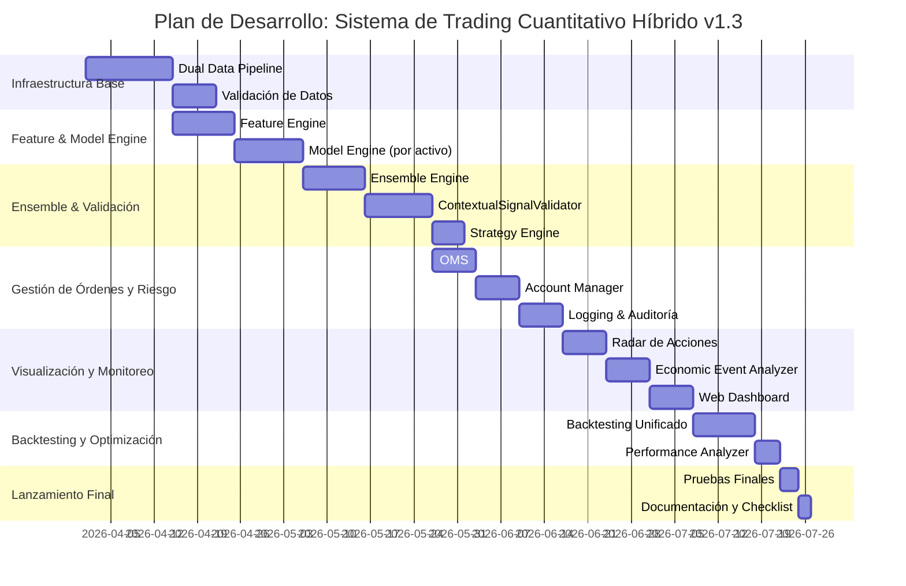

El plan incluye:
- **Fases de desarrollo secuenciales y realistas**.
- **Especificaciones técnicas detalladas por componente**.
- **Dependencias entre módulos**.
- **Criterios de aceptación**.

---

# 📅 Plan de Desarrollo y Especificaciones Técnicas  
**Sistema:** Sistema Integral de Trading Algorítmico Multiactivos  
**Versión del Plan:** 1.3  
**Fecha:** 31 de marzo de 2026  

---

## 🧱 Principios del Plan

- **Incremental**: Cada fase entrega valor funcional.
- **Validable**: Cada componente tiene criterios de aceptación claros.
- **Backtest-first**: Todo modelo o lógica debe validarse antes de producción.
- **Modular**: Los componentes son independientes y reemplazables.
- **Documentado**: Cada módulo incluye logging, tests y documentación.

---

## 🗂️ Fase 1: Infraestructura Base y Dual Data Pipeline  
**Duración estimada:** 2 semanas  
**Objetivo:** Establecer la base de datos, captura de datos dual y validación.

### Componentes a desarrollar:

| Componente | Especificaciones Técnicas | Dependencias | Criterios de Aceptación |
|-----------|--------------------------|--------------|--------------------------|
| **`MarketDataAdapter`** | - Interfaz abstracta `IMarketData`.   - Implementaciones: `MT5Adapter` (producción), `YFinanceAdapter`, `CCXTAdapter` (research).   - Soporta OHLCV + volumen + ticks (MT5). | Ninguna | - Puede obtener 1 año de datos históricos sin fallos.   - Streaming en tiempo real estable >99%. |
| **`EventFeedAdapter`** | - Scraping controlado de ForexFactory (Playwright).   - API de Google Calendar Económico (alternativa).   - Clasificación automática: alto/medio/bajo impacto. | `MarketDataAdapter` | - Eventos llegan con ≥15 min de anticipación.   - Impacto clasificado correctamente en 90%+ de casos. |
| **`DataValidator`** | - Detecta: gaps >5σ, precios negativos, volumen cero en activos líquidos, saltos sin causa.   - Emite alertas y bloquea señales si hay anomalía crítica. | `MarketDataAdapter` | - Anomalías detectadas en <1 segundo.   - Falsos positivos <2%. |
| **`Repository`** | - SQLite para producción (tablas: `market_data`, `events`, `logs`).   - PostgreSQL opcional para research (misma estructura).   - SQLAlchemy como ORM. | Todos los anteriores | - Escritura/lectura concurrente estable.   - Backups automáticos diarios. |

---

## ⚙️ Fase 2: Feature Engine y Model Engine  
**Duración estimada:** 3 semanas  
**Objetivo:** Generar features y entrenar modelos especializados por clase de activo.

### Componentes:

| Componente | Especificaciones Técnicas | Dependencias | Criterios de Aceptación |
|-----------|--------------------------|--------------|--------------------------|
| **`FeatureEngine`** | - Features técnicas: RSI, EMA, ATR, MACD, volatilidad.   - Features fundamentales: P/E, ROE, inventarios EIA (acciones/commodities).   - Sentimiento: FinBERT/DistilBERT sobre titulares.   - Normalización Z-score rolling. | `MarketDataAdapter`, `EventFeedAdapter` | - Features generadas en <500ms por activo.   - Reproducibles (mismo input → mismo output). |
| **`ModelEngine`** | - **Forex**: XGBoost + HMM.   - **Commodities energéticos**: LightGBM + Prophet.   - **Metales preciosos**: Random Forest + VIX.   - **Acciones**: LightGBM + sentimiento + fundamentales.   - **Cripto**: LSTM.   - Entrenamiento automático con Optuna. | `FeatureEngine` | - Walk-forward Sharpe >1.0 en out-of-sample.   - Modelo versionado y registrado en DB. |

---

## 🔀 Fase 3: Ensemble, Validación Contextual y Estrategia  
**Duración estimada:** 3 semanas  
**Objetivo:** Fusionar señales y validar con IA especializada.

### Componentes:

| Componente | Especificaciones Técnicas | Dependencias | Criterios de Aceptación |
|-----------|--------------------------|--------------|--------------------------|
| **`EnsembleEngine`** | - Entradas: señal ML, régimen HMM, evento, sentimiento.   - Pesos dinámicos basados en volatilidad y régimen.   - Reglas de veto (ej. no operar en eventos altos).   - Salida: señal + confianza [0–1]. | `ModelEngine`, `EventFeedAdapter` | - Reduce drawdown vs modelo individual en backtest.   - Confianza calibrada (reliability diagram). |
| **`ContextualSignalValidator`** | - Base de prompts: `prompt_templates.db` (SQL schema definido).   - Renderizado Jinja2 con contexto actual.   - Llamada condicional a LLM (solo si confianza ∈ [0.4, 0.7]).   - Fallback: reducir tamaño si API falla. | `EnsembleEngine`, `FeatureEngine` | - Concordancia LLM ↔ Ensemble >75% en mercado estable.   - Costo de API < $5/día en promedio. |
| **`StrategyEngine`** | - Recibe señal validada.   - Consulta `AccountManager` para margen/exposición.   - Aplica trailing stop, scale-out parcial.   - Emite órdenes al OMS. | `ContextualSignalValidator`, `AccountManager` | - Órdenes generadas en <1s tras señal.   - 100% de decisiones logueadas. |

---

## 📊 Fase 4: Gestión de Órdenes, Cuenta y Logging  
**Duración estimada:** 2 semanas  
**Objetivo:** Ejecución segura, trazable y con gestión de riesgo.

### Componentes:

| Componente | Especificaciones Técnicas | Dependencias | Criterios de Aceptación |
|-----------|--------------------------|--------------|--------------------------|
| **`OMS`** | - Tipos: Market, Limit, Stop, Trailing.   - Validación en tiempo real: margen, apalancamiento, drawdown.   - Magic Numbers únicos por estrategia.   - Reintentos automáticos (3 intentos). | `StrategyEngine`, `AccountManager` | - Órdenes ejecutadas con slippage <0.1%.   - 0 órdenes perdidas por fallo de conexión. |
| **`AccountManager`** | - Métricas: equity, balance, margen libre, drawdown.   - Volatility targeting: ajusta apalancamiento para mantener σ_target.   - Kill switch si drawdown >10%. | `OMS`, `MarketDataAdapter` | - Actualización de métricas en <500ms.   - Kill switch activado en <10s tras breach. |
| **`Logging & Audit`** | - Tablas: `predictions`, `signals`, `orders`, `events`, `prompts_llm`.   - Timestamp UTC estricto.   - Snapshots diarios de estado de cuenta. | Todos los módulos | - Capacidad de reproducir cualquier día de trading.   - Queries de auditoría en <2s. |

---

## 👁️ Fase 5: Radar, Eventos y Dashboard  
**Duración estimada:** 2 semanas  
**Objetivo:** Visualización, monitoreo proactivo y alertas.

### Componentes:

| Componente | Especificaciones Técnicas | Dependencias | Criterios de Aceptación |
|-----------|--------------------------|--------------|--------------------------|
| **`RadarDeAcciones`** | - Universo: S&P 500 + top 100 cripto/commodities.   - Heatmap con RSI, momentum, volumen relativo.   - Alertas para `StrategyEngine`. | `FeatureEngine`, `ModelEngine` | - Actualización cada 5 min.   - Latencia <1s en selección de activo. |
| **`EconomicEventAnalyzer`** | - Bloqueo automático de trading 15 min antes/después de evento alto.   - Ajuste de exposición según sensibilidad del activo. | `EventFeedAdapter`, `StrategyEngine` | - 100% de eventos altos gestionados.   - Falsos bloqueos <5%. |
| **`WebDashboard`** | - Tecnología: Dash con WebSocket.   - Vistas: velas, cartera agrupada, radar, eventos, PnL.   - Filtros dinámicos por activo/clase. | Todos los módulos | - Actualización en tiempo real (<1s).   - Funciona en móvil y desktop. |

---

## 🔁 Fase 6: Backtesting Unificado y Optimización  
**Duración estimada:** 2 semanas  
**Objetivo:** Validar todo el sistema en simulación antes de producción.

### Componentes:

| Componente | Especificaciones Técnicas | Dependencias | Criterios de Aceptación |
|-----------|--------------------------|--------------|--------------------------|
| **`BacktestingFramework`** | - Stack: `VectorBT` (rápido) + `backtrader` (fidelidad).   - Mismo código que producción (`StrategyEngine`, `OMS`).   - Simulación de slippage, latencia, costos. | Todos los módulos | - Paridad backtest-producción >95%.   - Walk-forward analysis obligatoria. |
| **`PerformanceAnalyzer`** | - Reportes con `quantstats`: Sharpe, Sortino, Calmar, drawdown.   - Comparación contra benchmark (SP500, BTC). | `BacktestingFramework` | - Reporte HTML interactivo generado automáticamente.   - Métricas auditables y reproducibles. |

---

## ✅ Fase 7: Pruebas Finales, Documentación y Lanzamiento  
**Duración estimada:** 1 semana  
**Objetivo:** Preparar el sistema para producción estable.

### Actividades:
- Pruebas de estrés (100 activos simultáneos).
- Auditoría de seguridad (MT5, dashboard).
- Documentación final: `README.md`, `SOFTWARE_ARCHITECTURE.md`, guía de usuario.
- Script de despliegue automatizado (Docker opcional).
- Checklist de lanzamiento: logging activo, fallbacks probados, kill switch funcional.

---

## 📌 Notas Finales

- **Total estimado:** 15 semanas (~4 meses).
- **Equipo recomendado:** 1–2 desarrolladores full-stack cuantitativos.
- **Priorización:** Si el tiempo es limitado, prioriza Fases 1–4 + backtesting (Fase 6).
- **Escalabilidad futura**: Los módulos críticos (Radar, Event Analyzer) pueden convertirse en microservicios.

